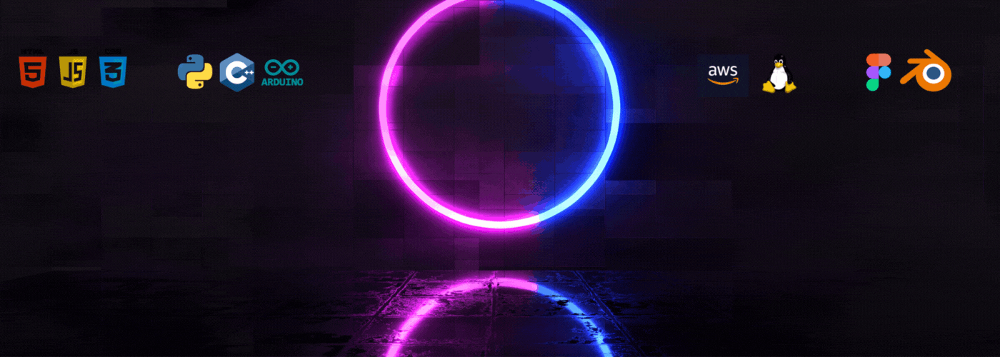

<h1 align="center">Hi, I'm <a href="https://www.linkedin.com/in/abhishek-kaushik-b677a2260" target="_blank">ABHISHEK KAUSHIK</a>

  
<h3 align="center">A dedicated student with Software development & Cybersecurity skills</h3>

# 💫 About Me:
 
<b>Hello </b> , pleased to meet you Viewer !
  I have gained hands-on expertise in building secure applications, managing IoT systems, and implementing cybersecurity measures, worked on penetration testing, vulnerability assessments, cryptography, and secure coding practices. 
  Additionally, I have managed IoT projects involving embedded systems,sensor networks, and cloud integration, ensuring both functionality and security.
With a strong passion for innovation,
 I actively work on real-world projects and collaborate with others to develop efficient, scalable, and secure solutions.My goal is to bridge the gap between development, security, and IoT to create impactful technology solutions."🚀

 <h2>

</h2>

<h1>Tech Skills 💻</h1>
   
I have learned & explored various Domains few of them are as follows, <b>'Full stack web-development'</b>, <b>'Data analysis</b>', <b>'Cyber encryption'</b> and all the latest python frameworks [OpenCV, MediaPipe] and many more productivity tools.I have Worked on various Projects related to Artifical Intelligence,IOT,Augumented Reality etc,Adiitionally, I am certified by multiple plateforms.
  

 

 

 <h1 align="center">Let's Get Connected🤝</h1>

 

  

<table>
<tr>
    <td></td>
    <td></td>
</tr>
</table>

<table>
<tr>
    <td></td>
    <td></td>
</tr>
</table>

 

